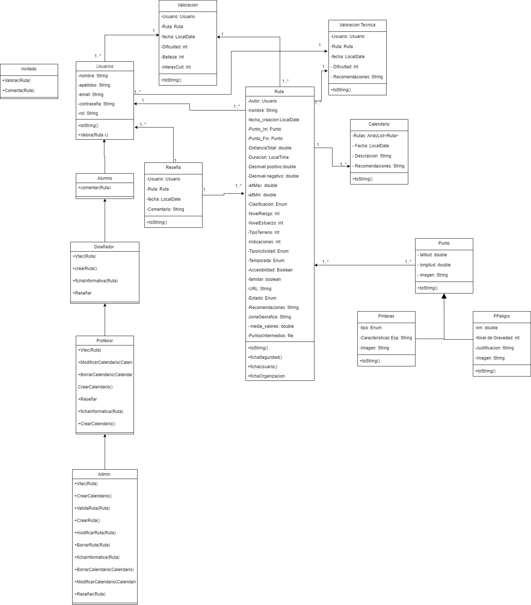
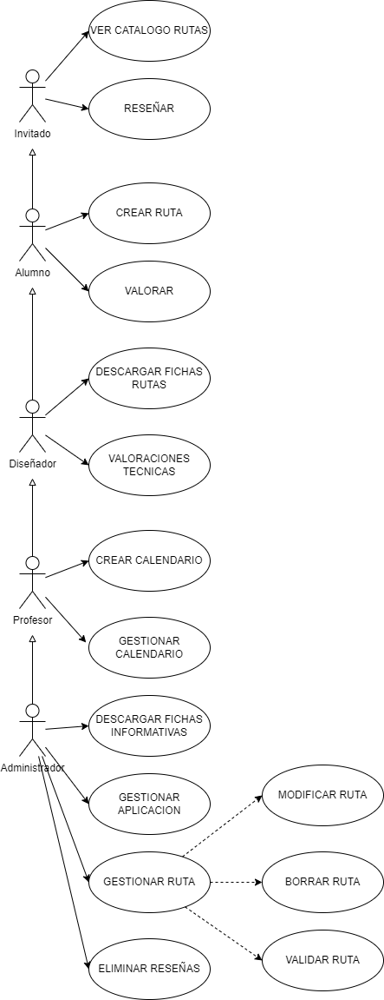

# FOURDAM

## Índice
1. [Descripción del Proyecto](#descripción-del-proyecto)
2. [Participantes](#participantes)
3. [Diagrama Entidad-Relación (E/R)](#diagrama-entidad-relación-er)
4. [Diagrama Relacional](#diagrama-relacional)
5. [Script BDD](#script-bdd)
6. [Diagrama de Clases](#diagrama-de-clases)
7. [Diagrama de Casos de Uso](#diagrama-de-casos-de-uso)
8. [XSLT](#xslt)
9. [Pagina web](#pagina-web)
10. [Infografía Seguridad Social](#infografía-seguridad-social)
11. [Subsidios Seguridad Social](#subsidios-de-la-seguridad-social)
12. [Instalación](#instalación)
13. [Uso](#uso)

## Descripción del Proyecto
Resumen del objetivo del proyecto, su funcionalidad principal y tecnologías utilizadas.

## Participantes
- Rebeca Cabo Cianca  (@Rebeca467)
- Oriol Fernández Saiz  (@MaxwellRoyers)
- Fabián Saiz Landeras  (@Napster002)
- Ciro  Galán Vertiz  (@CiroGalanVertiz)
- Ana María Rodríguez Méndez  (@anarodriguezm)

## Diagrama Entidad-Relación (E/R)
[Ver el Diagrama E/R](./diagrama-er.pdf)

> El diagrama muestra las entidades principales, sus relaciones y atributos clave en el sistema.

## Diagrama Relacional
[Ver el Diagrama Relacional](diagramaRelacional-definitivo.mwb)

> Representa las entidades, relaciones y atributos clave del sistema.

## Script BDD
[Ver el Script de bases de datos](bd-script-grupo4-definitivo.sql)

> Contiene las instrucciones SQL para crear y estructurar la base de datos.

## Diagrama de Clases


> El diagrama de clases ilustra la estructura del sistema orientado a objetos, incluyendo clases, métodos y relaciones de herencia o asociación.

## Diagrama de Casos de Uso



### 1. Creación de Ruta

#### Descripción General
Este caso de uso permite a los diseñadores crear nuevas rutas en el sistema, incluyendo todos sus detalles y puntos asociados.

#### Detalles del Caso de Uso

| **Aspecto**       | **Descripción**                                                                 |
|--------------------|---------------------------------------------------------------------------------|
| **Actores**        | Principal: Diseñador<br>Secundario: Sistema                                    |
| **Precondiciones** | - El diseñador debe estar autenticado en el sistema<br>- Debe tener permisos de creación de rutas |
| **Postcondiciones**| - Nueva ruta creada y almacenada en el sistema<br>- Puntos de la ruta registrados y vinculados |
| **Flujo Principal**| 1. El diseñador selecciona la opción "Crear Nueva Ruta".<br>2. El sistema muestra el formulario de creación.<br>3. El diseñador ingresa los datos básicos (nombre, fecha, tipo de actividad, dificultad).<br>4. El diseñador añade puntos a la ruta, especificando:<br>   - Coordenadas (latitud/longitud).<br>   - Tipo de punto (interés/peligro).<br>   - Características específicas.<br>5. El sistema valida los datos ingresados.<br>6. El sistema guarda la ruta y sus puntos. |
| **Flujos Alternativos** | - Si los datos son inválidos, el sistema muestra mensajes de error.<br>- Si falla la conexión, el sistema guarda un borrador temporal. |


### 2. Valoración de Ruta

#### Descripción General
Permite a los usuarios calificar y valorar técnicamente las rutas existentes.

#### Detalles del Caso de Uso

| **Aspecto**       | **Descripción**                                                                 |
|--------------------|---------------------------------------------------------------------------------|
| **Actores**        | Principal: Usuario<br>Secundario: Sistema                                      |
| **Precondiciones** | - Usuario autenticado<br>- Ruta existente en el sistema                        |
| **Postcondiciones**| - Valoración registrada<br>- Media de valoraciones actualizada                 |
| **Flujo Principal**| 1. Usuario selecciona una ruta para valorar.<br>2. El sistema muestra el formulario de valoración.<br>3. Usuario ingresa:<br>   - Puntuación de dificultad.<br>   - Valoración de interés cultural.<br>   - Comentarios adicionales.<br>4. El sistema valida la valoración.<br>5. El sistema actualiza las estadísticas de la ruta. |
| **Flujos Alternativos** | - Si el usuario ya valoró la ruta, puede modificar su valoración anterior. |


### 3. Gestión de Calendario

#### Descripción General
Permite a profesores y administradores gestionar el calendario de actividades y rutas.

#### Detalles del Caso de Uso

| **Aspecto**       | **Descripción**                                                                 |
|--------------------|---------------------------------------------------------------------------------|
| **Actores**        | Principal: Profesor/Admin<br>Secundario: Sistema                               |
| **Precondiciones** | - Usuario con rol de profesor o admin<br>- Existencia de rutas en el sistema   |
| **Postcondiciones**| - Calendario actualizado<br>- Eventos programados                             |
| **Flujo Principal**| 1. Profesor/Admin accede a la gestión de calendario.<br>2. El sistema muestra el calendario actual.<br>3. Usuario puede:<br>   - Añadir nuevos eventos.<br>   - Asociar rutas a fechas.<br>   - Establecer recomendaciones.<br>4. El sistema valida y guarda los cambios. |
| **Flujos Alternativos** | - Modificación de eventos existentes.<br>- Cancelación de eventos programados. |


### 4. Sistema de Reseñas

#### Descripción General
Permite a los usuarios escribir y gestionar reseñas detalladas sobre las rutas.

#### Detalles del Caso de Uso

| **Aspecto**       | **Descripción**                                                                 |
|--------------------|---------------------------------------------------------------------------------|
| **Actores**        | Principal: Usuario<br>Secundario: Sistema                                      |
| **Precondiciones** | - Usuario autenticado<br>- Ruta existente                                      |
| **Postcondiciones**| - Reseña publicada<br>- Historial de reseñas actualizado                       |
| **Flujo Principal**| 1. Usuario selecciona "Escribir Reseña".<br>2. El sistema muestra el formulario.<br>3. Usuario ingresa:<br>   - Comentario detallado.<br>   - Fecha de realización.<br>   - Experiencia personal.<br>4. El sistema valida y publica la reseña. |
| **Flujos Alternativos** | - Edición de reseñas propias.<br>- Moderación de contenido inapropiado. |


### 5. Gestión de Puntos de Interés/Peligro

#### Descripción General
Permite añadir y gestionar puntos de interés y peligro en las rutas.

#### Detalles del Caso de Uso

| **Aspecto**       | **Descripción**                                                                 |
|--------------------|---------------------------------------------------------------------------------|
| **Actores**        | Principal: Diseñador<br>Secundario: Sistema                                   |
| **Precondiciones** | - Diseñador autenticado<br>- Ruta existente                                   |
| **Postcondiciones**| - Puntos añadidos a la ruta<br>- Información de seguridad actualizada         |
| **Flujo Principal**| 1. Diseñador selecciona un punto en la ruta.<br>2. Elige tipo de punto (interés/peligro).<br>3. Ingresa detalles específicos:<br>   - Para interés: características especiales, DPC.<br>   - Para peligro: nivel de gravedad, justificación.<br>4. El sistema valida y registra el punto. |
| **Flujos Alternativos** | - Modificación de puntos existentes.<br>- Eliminación de puntos obsoletos. |


## Pagina Web 
[Ver la pagina web](./pagina%20web/index.html)

> Interfaz web con diseño limpio y funcional para promocionar la aplicacion.

## XSLT 
[Ver XSLT para generación de CSV](./xslt-csv.xslt)

> La hoja de estilo XSLT define la transformación de un documento XML a formato CSV, especificando plantillas y reglas para recorrer y convertir los nodos del XML en registros delimitados por comas.

## Infografía Seguridad Social
[Ver Infografias](./info-seguridad-social.pdf)

> Documento visual que consta sobre multiples apartados de la Seguridad Social.

## Subsidios de la Seguridad Social
[Ver subsidios](./subsidios_SS.pdf)

> Documento donde se presenta el cálculo de los subsidios de la Seguridad Social.

## Instalación
```bash
git clone https://github.com/Rebeca467/DAM1_GRUPO4_2025
cd proyecto
npm install
```

## Uso
Aun se esta trabajando en la aplicacion...
